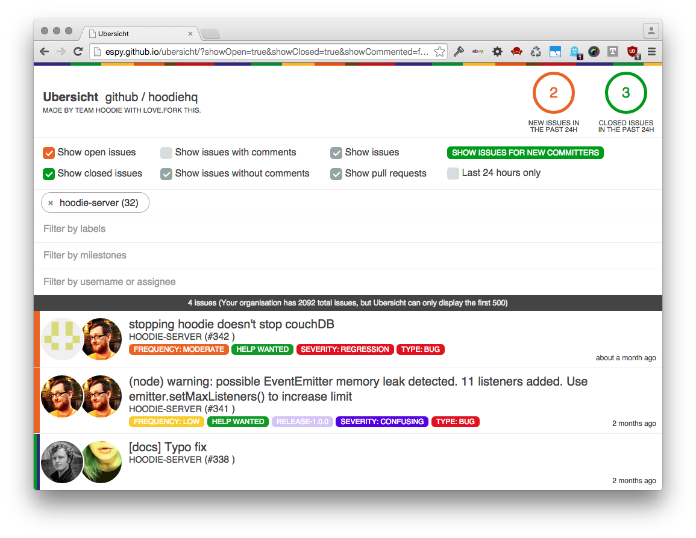

# Ubersicht

Ubersicht is a lightweight, frontend only dashboard for all the public repos of any github organisation. Change the hash in the url to your github user or organisation name to use it for yourself. [Give it a try](http://espy.github.io/ubersicht)!

It runs as a gh-page, so you can just fork this repo, change the `githubOrganisation`-variable in `main.js` and you've got your own public github dashboard you can style and mod at your whim.

Ubersicht filters milestones by name, not by id, which means that if you use consistent milestone names across repos, you can have quasi-cross-repo milestones. How cool is that?

It requires no API key and no data storage and only uses a single API request to fetch data. For this reason, it can only fetch the last 500 issues though.

Thanks!
